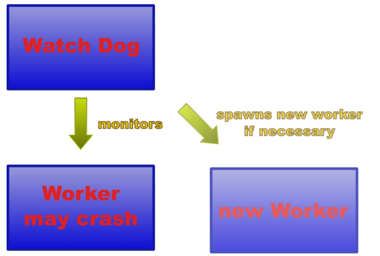

## Process Pair approach

The approach is to have a pair of processes: a worker and a watch dog. The worker is your regular service. The watch dog process waits for the worker to crash. It spawns an new worker process immediately after the original has worker crashed.

### Implementation

The watch dog and the worker are implemented in the same executable file. When the application starts the watch dog is active. It uses `fork` to spawn a new process. The new process is the worker and is responsible for providing the service, i.e., the purpose of the application. It starts running the implemented service in an endless loop.

The watch dog process uses `waitpid` to wait until the worker process ends. When `waitpid` returns the worker has crashed, the watchdog spawns a new one and writes some error log including the reasons for the crash (signal that killed the worker).

### Enhancements

#### Graceful degradation

It might happen that `fork` fails. A possible reason is a overloaded system with too few resources to spawn a new process. If the watch dog terminates there will be no service at all. But if the watch dog serves the service as a worker you will have service until the worker crashes. That is called graceful degradation.

#### Check-pointing

Each time the worker crashes it loses its state. If the state is important to the service, this might be unacceptable. One solution is to have a so called hard state: you store your state in a way that it survives a crash. You can implement this by writing your current state to hard disc on each change. Such a state is also called check-point.

Before a newly created worker starts to run its service, it looks on hard disc for a check-point. It loads its state form this check-point if it exists.

The hard-state should be small and change only with a low frequency. Otherwise the check-pointing will have a negative influence on the performance of your service.

For this implementation, shared memory is used to store the hard state. Shared memory/Database/File any of these could be used to store the state.

##### Why do we need something like a Shared Memory?

Assuming we don't use a shared memory - after a fork(), the child process (worker) will receive a copy of the parent's memory. Changes made by the child (worker) to state variable will not reflect in the parent's memory (the watchdog). There will be separate variables in each process. However, with shared memory we can achieve IPC.
